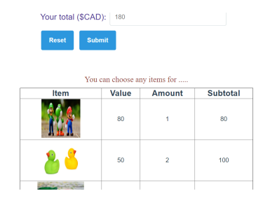

# CST8209 – Mini Project for Practical final

## Objective

Using JavaScript you will be:

-   [ ] Create and validate form with miscellaneous input types, submit and reset.
-   [ ] Manipulate DOM based on user interaction
-   [ ] Manifest programming skills using private/public functions, loops, classes and proper naming and outlining convention using JavaScript.

## Instructions

-   [ ] You must use at least one class, think what you can model as class.
-   [ ] You must use the module pattern, or some equivalent that allows private/public functions.
-   [ ] You must choose which functions should be public or private correctly
-   [ ] All JavaScript and CSS must be in external files.
-   [ ] Events cannot be added in the HTML, they must be unobtrusive using best practice.
-   [ ] You must submit a ZIP file in the following format: `CST8209_firstName_lastName_studentNumber.zip`
-   [ ] You must not directly copy any code or algorithms from other sources (get hints, use your own code)

## Folder Structure

```
CST8209_firstName_lastName_studentNumber
├── scripts
│   └── [your scripts]
├── css
│   └── [your styles]
├── images
│   └── [your images]
├── data.json
└── index.html
```

## Requirements

Create a webpage of your choice that delivers at least the followings:

1. Page Title and header, followed by a paragraph stating what the page is about
1. Form with different types of inputs and validation rule
    1. Text (min and max length)
    1. Number (min and max of your choice)
    1. Date ( verify input to be after specific date
    1. A List that allows editing input and single selection (Required)
    1. Checkbox
    1. Radio(at least 3 options) (Required)
    1. Submit and reset buttons(Required)
    1. A read only input to show the total(please see #4)
1. Form validation:
    1. Proper styles and warning to user to indicate validation rule
    1. Required input to be indicated ahead
    1. Don’t used tables to structure your webform, let’s use fieldset and legend https://developer.mozilla.org/en-US/docs/Learn/Forms/How_to_structure_a_web_form
1. Shopping items:
   Create a presentation of at least 4 columns (see example below) - please try not to use a `<table>` like the example below.
    1. An item has a name, image and price (you can add more if you wish, like: category, quantity, etc.)
    1. Your shopping list will load from a data.json files, make sure the image file are already stored in images folder of your website folder
    1. When you click on the picture you update the amount and subtotal (some will use +/-buttons)
    1. The total should be reflected in the form (input 2.h up)
    1. Display for each item: image and name, you can keep your price hidden if you wish or as an data-attribute in the image element.
1. Summary:
   Below the item table dynamically display 1 bullet list (ul) and 1 ordered lit (ol)
    - User info:
        - Name
        - Address
        - …
    - You picked the following items
        1. 2 Duck
        1. 3 Car
        1. …



## Marking Scheme Rubric

| Rubric                                                                                                                                                                                                                                | Marks |
| ------------------------------------------------------------------------------------------------------------------------------------------------------------------------------------------------------------------------------------- | ----- |
| Code is organized and properly formatted, indentation, JavaScript and CSS must be in external files, …                                                                                                                                | 5     |
| Comments (useful, help understand the program)                                                                                                                                                                                        | 5     |
| Instructions and conventions followed: <ul><li>Names of var, functions, … are meaningful and following conventions</li><li>Class used and properly defined</li><li>Private/public functions</li><li>Events properly defined</li></ul> | 15    |
| DOM displayed with proper conventions                                                                                                                                                                                                 | 10    |
| Form validation                                                                                                                                                                                                                       | 15    |
| Front-end HTML and CSS look good and makes sense                                                                                                                                                                                      | 10    |
| Form submission/reset works correctly, no alerts                                                                                                                                                                                      | 5     |
| Total                                                                                                                                                                                                                                 | 70    |
