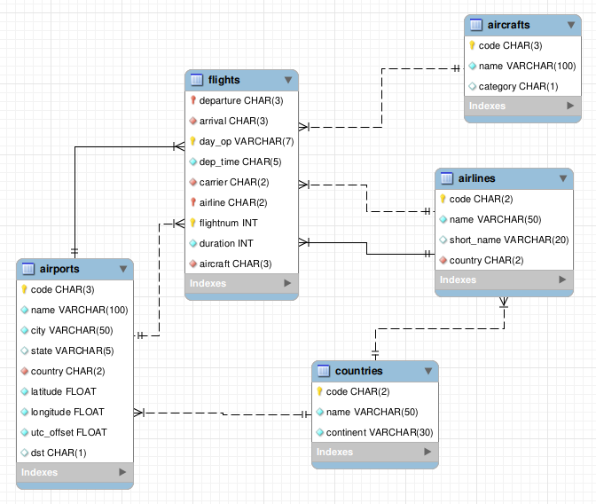
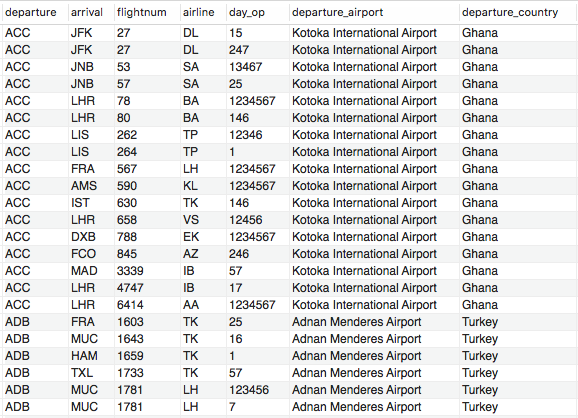
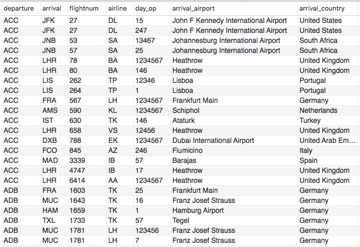
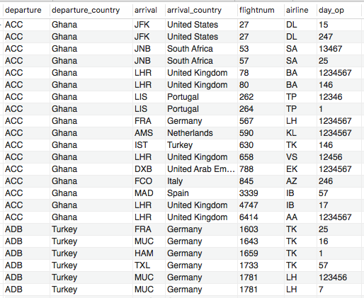
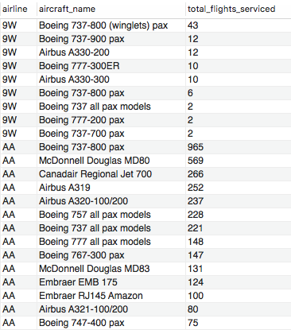
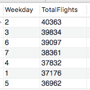
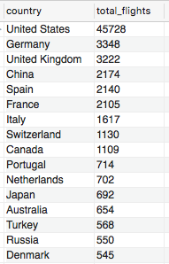
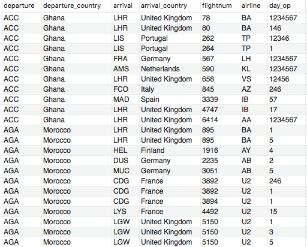
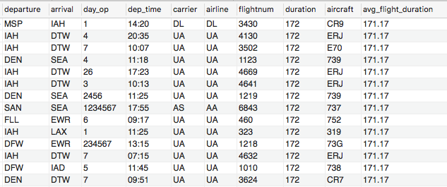

# CST8260 - Lab 12

## Reference Tables

### Countries

Table of country names. Primary key is the field **code**.

### Aircrafts

Table of aircrafts/airplanes. Primary key is the field **code**.

### Airlines

Table of airlines. Identified by their 2-character IATA (International Air Transport Association) code. Primary key is the field **code**.

### Airports

Table of airports. Identified by their 3-character IATA code. Column **city** is the main city served by the airport, not the actual location of the airport. Columns **latitude** and **longitude** can be used to compute distances between airports. Column **utc_offset** contains a numerical value giving the number of hours between local time and UTC; it's not necessarily an integer value (3.5 indicates a 3:30 difference). Column **dst** contains a code telling which rule to apply for Daily Saving Time (not used). Primary key is the field **code**.

### Flights

Columns **departure** and **arrival** are the codes of the departure and arrival airports (both reference **airports**). Flights aren't necessarily daily flights; **day_op** contains a string of digits saying when the flight is operated (1 = Monday, 2 = Tuesday, 3 = Wednesday, 4 = Thursday, 5 = Friday, 6 = Saturday, 7 = Sunday). The time of departure (local time at the place of departure) is given as H24:MI in column **dep_time** (24 hour clock). The flight number is given by two columns, **airline** that references the **airlines** table, and **flightnum**. Because of code sharing the flight isn't necessarily operated by the company selling the ticket (the code of which is in **airline**); the code of the company actually operating the flight is in column **carrier**. Primary key is the combination of the followinf fields: **departure, day_op, airline, flightnum.**

## Questions

1. Prepare a report where you will show the departure airport, arrival airport, the flight number,
   the airline, the days it operates, the name of the departure airport as well as the departure country. Sort the result by departure airport code, then by flight number.

    

2. Prepare a report where you will show the departure airport, arrival airport, the flight number,
   the airline, the days it operates, the name of the arriving airport as well as the arriving country.
   Sort the result by departure airport code, then by flight number.

    

3. Prepare a table/report which will show both the departure airport country and the arrival airport country in the same
   view. See example. Order the result by departure airport then flight number. This will not work without correct join conditions.

    HINT: Look at the primary key in the flights table

    

4. Prepare a report which will show the top aircraft for each airline based on the number of flights serviced. See
   example. Order the result by airline and then by the total number of flights serviced.

    

5. Create a report of the airlines sorted by the most flights per airline in descending order. Make sure to include the airline name.

    

6. Find which day of the week has the most flights in total, regardless of arrivals or departures.

    

7. Find out which country has the most arriving flights.

    

8. Create a view which shows the flights departing from North America and arriving in Europe.

    

9. Return the flight data from flights table where the flight duration is greater than the average flight duration.
   Also return as a column added to the end of the table, the average flight duration so every row has the duration showing.

    
